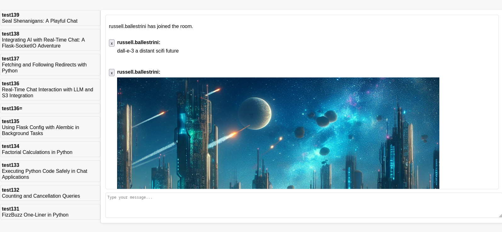

flask-socketio-llm-completions
========================================

This project is a chatroom application that allows users to join different chat rooms, send messages, and interact with multiple language models in real-time. The backend is built with Flask and Flask-SocketIO for real-time web communication, while the frontend uses HTML, CSS, and JavaScript to provide an interactive user interface.

To view a short video of the chat in action click this screenshot:

Features
--------

- Real-time messaging between users in a chatroom.
- Ability to join different chatrooms with unique URLs.
- Integration with language models for generating room titles and processing messages.
- Syntax highlighting for code blocks within messages.
- Markdown rendering for messages.
- Commands to load and save code blocks to AWS S3.
- Database storage for messages and chatrooms using SQLAlchemy.
- Migration support with Flask-Migrate.

Requirements
------------

- Python 3.6+
- Flask
- Flask-SocketIO
- Flask-SQLAlchemy
- Flask-Migrate
- eventlet or gevent
- boto3 (for interacting with AWS Bedrock currently Claude, and S3 access)
- openai (for interacting with OpenAI's language models)
- mistralai (for interacting with MistralAI's language models)
- together (for interacting with together.ai language models)

Installation
------------

To set up the project, follow these steps:

1. Clone this repository::

    git clone https://github.com/russellballestrini/flask-socketio-llm-completions.git
    cd flask-socketio-llm-completions

2. Create a virtual environment and activate it::

    python3 -m venv ven
    source env/bin/activate  # On Windows use `env\Scripts\activate`

3. Install the required dependencies::

    pip install -r requirements.txt

4. Initialize the database:

   Before running the application for the first time, you need to create the database and tables, and then stamp the Alembic migrations to mark them as up to date. Follow these steps::

        python init_db.py
        flask db stamp head

Usage
-----

Set up environment variables for your AWS, OpenAI, MistralAI, or together.ai API keys::

    export AWS_ACCESS_KEY_ID="your_access_key"
    export AWS_SECRET_ACCESS_KEY="your_secret_key"
    export S3_BUCKET_NAME="your_s3_bucket_name"
    export OPENAI_API_KEY="your_openai_api_key"
    export MISTRAL_API_KEY="your_mistralai_api_key"
    export TOGETHER_API_KEY="your_togetherai_api_key"

To start the application with socket.io run::

    python app.py

Optionally pass ``python app.py --profile <aws-profile-name>`` 

The application will be available at ``http://127.0.0.1:5001`` by default.

Interacting with Language Models
--------------------------------

To interact with the various language models, you can use the following commands within the chat:

- For GPT-3, send a message with ``gpt-3`` and include your prompt.
- For GPT-4, send a message with ``gpt-4`` and include your prompt.
- For Claude-v1, send a message with ``claude-v1`` and include your prompt.
- For Claude-v2, send a message with ``claude-v2`` and include your prompt.
- For Mistral-tiny, send a message with ``mistral-tiny`` and include your prompt.
- For Mistral-small, send a message with ``mistral-small`` and include your prompt.
- For Mistral-medium, send a message with ``mistral-medium`` and include your prompt.
- For Together OpenChat, send a message with ``together/openchat`` and include your prompt.
- For Together Mistral, send a message with ``together/mistral`` and include your prompt.
- For Together Mixtral, send a message with ``together/mixtral`` and include your prompt.
- For Together Solar, send a message with ``together/solar`` and include your prompt.
- For Dall-e-3, send a message with ``dall-e-3`` and include your prompt.

The system will process your message and provide a response from the selected language model.

Commands
--------

The application supports special commands for interacting with the chatroom:

- ``/s3 load <file_path>``: Loads a file from S3 and displays its content in the chatroom.
- ``/s3 save <file_path>``: Saves the most recent code block from the chatroom to S3.
- ``/s3 ls <file_s3_path_pattern>``: Lists files from S3 that match the given pattern. Use ``*`` to list all files.
- ``/title new``: Generates a new title which reflects conversation content for the current chatroom using gpt-4.
- ``/cancel``: Cancel the most recent chat completion from streaming into the chatroom.
- ``/python``: Executes the most recent Python code block sent in the chatroom and returns the output or any errors.

The ``/s3 ls`` command can be used to list files in the connected S3 bucket. You can specify a pattern to filter the files listed. For example:

- ``/s3 ls *`` will list all files in the bucket.
- ``/s3 ls *.py`` will list all Python files.
- ``/s3 ls README.*`` will list files starting with "README." and any extension.

The command will return the file name, size in bytes, and the last modified timestamp for each file that matches the pattern.

Structure
---------

- ``app.py``: The main Flask application file containing the backend logic.
- ``chat.html``: The HTML template for the chatroom interface.
- ``static/``: Directory for static files like CSS, JavaScript, and images.
- ``templates/``: Directory for HTML templates.

Contributing
------------

Contributions to this project are welcome. Please follow the standard fork and pull request workflow.

License
-------

This project is public domain. It is free for use and distribution without any restrictions.
